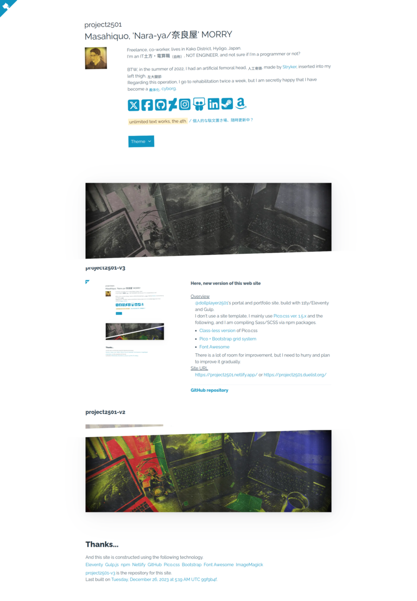

> [!CAUTION]
> The following packages are currently out of date.  
>  
>  @11ty/eleventy   ^2.0.1  →  ^3.0.0  
>  @picocss/pico   ^1.5.13  →  ^2.0.6  
>  gulp             ^4.0.2  →  ^5.0.0  
>  
> The currently known bug is that when Gulp is updated to the latest version, Gulp-webp is unable to properly convert to webp or copy png.  
> Also, when compiling Sass/SCSS, a lot of warnings will appear.

&nbsp;&nbsp;

The URLs below point to the same site.

- [https://project2501.netlify.app/](https://project2501.netlify.app/)
- [https://project2501.duelist.org/](https://project2501.duelist.org/)

## What is this?

[@dollplayer2501](https://github.com/dollplayer2501)'s portal and portfolio site? build with 11ty/Eleventy and Gulp.

- One page website
- Back end system is [11ty/Eleventy](https://www.11ty.dev/) and Gulp.
    - Eleventy
        - [eleventy-plugin-directory-output plugin](https://www.npmjs.com/package/@11ty/eleventy-plugin-directory-output)
        - [html-minifier](https://www.npmjs.com/package/html-minifier)
        - [Nunjucks](https://www.11ty.dev/docs/languages/nunjucks/) included in 11ty/Eleventy
        - Use [markdown-it](https://www.npmjs.com/package/markdown-it) and [markdown-it-deflist](https://www.npmjs.com/package/@gerhobbelt/markdown-it-deflist) instead of [build in Markdown](https://www.11ty.dev/docs/languages/markdown/)
    - Gulp
        - [gulp-dart-sass](https://www.npmjs.com/package/gulp-dart-sass) with [gulp-sourcemaps](https://www.npmjs.com/package/gulp-sourcemaps)
            - [Class-less version](https://picocss.com/docs/classless.html) of [Pico.css v1.5.x](https://picocss.com/)
            - [Pico + Bootstrap grid system](https://picocss.com/examples/bootstrap-grid/)
            - [Fontawesome-free](https://www.npmjs.com/package/@fortawesome/fontawesome-free)
        - [gulp-terser](https://www.npmjs.com/package/gulp-terser) with [gulp-sourcemaps](https://www.npmjs.com/package/gulp-sourcemaps)
        - [gulp-webp](https://www.npmjs.com/package/gulp-webp) with [lastrun](https://gulpjs.com/docs/en/api/lastrun/)
        - [gulp-mode](https://www.npmjs.com/package/gulp-mode)
        - [gulp-if](https://www.npmjs.com/package/gulp-if)
    - npm scripts
        - [cross-env](https://www.npmjs.com/package/cross-env)
        - [npm-run-all](https://www.npmjs.com/package/npm-run-all)
        - [rimraf](https://www.npmjs.com/package/rimraf)
        - [npm-check-updates](https://www.npmjs.com/package/npm-check-updates)
        - [npm serve](https://www.npmjs.com/package/serve)
    - Node.js versioning assumes the use of [rtx](https://github.com/jdxcode/rtx)

## Getting started

### 1. git clone

    git clone git@github.com:dollplayer2501/project2501-v3.git any-path-name
    cd any-path-name

### 2. Check the Node.js version if necessary

    rtx activate fish | source

Refer to [`./.tool-versions`](https://github.com/dollplayer2501/project2501-v3/blob/main/.tool-versions) for the current version used.

### 3. Npm and package install

    npm install

### 4. Start up

Check my [`./package.json`](https://github.com/dollplayer2501/project2501-v3/blob/main/package.json)'s `scripts` section.

#### 4.1 Build and/or watch locally

Output files are stored in `./any-path-name/_develop`.  
URL is `http://localhost:8080` (default).

    npm run develop:watch

#### 4.2. Build a product version and visual confirmation

Output files are stored in `./any-path-name/_product`.  
HTML, JavaScript and CSS are compressed, image files are converted to webp.

    npm run product:build

If you want to visually check using a web browser, please see below.  
URL is `http://localhost:3000` (default).

    npm run product:serve

## Memo

### Portfolio images

Portfolio images are created using ImagemMagick commands in Python.  
These Python scripts are invoked by shell scripts from an Npm script.

- [`./source/images/create_thumb.py`](https://github.com/dollplayer2501/project2501-v3/blob/main/source/images/create_thumb.py)
- [`./source/images/create_tiles.py`](https://github.com/dollplayer2501/project2501-v3/blob/main/source/images/create_tiles.py)

I plan to introduce light boxes in the near future.

//
